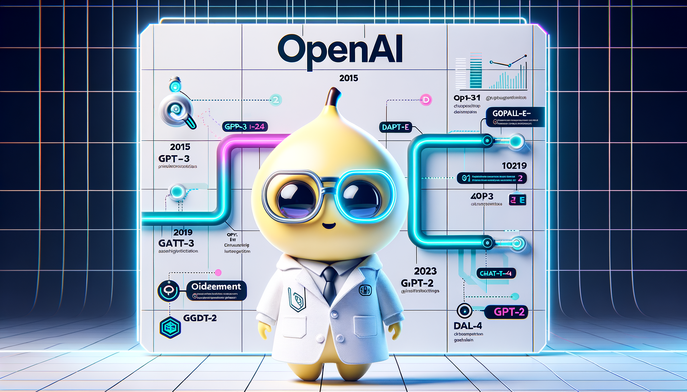

# Introdução à OpenAI

**Referência:** Seção 00 - Fundamentos

---

## O que é OpenAI?

A OpenAI é uma empresa de pesquisa em inteligência artificial fundada em 2015 com o objetivo de desenvolver IA de forma segura e benéfica para a humanidade. A organização começou como uma entidade sem fins lucrativos e em 2019 se tornou uma "capped-profit" company para atrair investimentos necessários ao desenvolvimento de modelos avançados.

## História e Evolução

### Fundação (Dezembro de 2015)
- Fundada por Elon Musk, Sam Altman, Greg Brockman, Ilya Sutskever, Wojciech Zaremba e John Schulman
- Objetivo inicial: desenvolver IA segura e benéfica
- Organização sem fins lucrativos

### Marcos Importantes

**Fevereiro de 2019 - GPT-2:**
- Modelo de linguagem com 1.5 bilhões de parâmetros
- Inicialmente não liberado publicamente devido a preocupações de segurança
- Capacidades impressionantes de geração de texto

**Maio de 2020 - GPT-3:**
- Modelo com 175 bilhões de parâmetros
- Few-shot learning - capacidade de aprender com poucos exemplos
- API pública lançada em junho de 2020, democratizando acesso à IA

**Janeiro de 2021 - DALL-E:**
- Primeiro modelo de geração de imagens a partir de texto
- Capacidade de criar imagens realistas e criativas

**Abril de 2022 - DALL-E 2:**
- Versão melhorada com maior qualidade e resolução
- Permite múltiplas imagens por requisição

**Novembro de 2022 - ChatGPT:**
- Interface conversacional baseada em GPT-3.5
- Popularizou LLMs para o público geral
- Mais de 100 milhões de usuários em 2 meses

**Março de 2023 - GPT-4:**
- Modelo multimodal (texto e imagens)
- Melhor compreensão e raciocínio
- Whisper melhorado

**Setembro de 2023 - DALL-E 3:**
- Versão mais recente com melhor qualidade
- Integração com ChatGPT

**Novembro de 2023 - GPT-4 Turbo:**
- Versão otimizada e mais rápida
- Contexto expandido (128k tokens)
- Preços reduzidos

## Modelos Disponíveis

### Chat Completions
- **GPT-3.5-turbo**: Rápido e econômico, adequado para maioria dos casos
- **GPT-4**: Mais poderoso (março 2023), melhor raciocínio, multimodal
- **GPT-4 Turbo**: Versão otimizada (novembro 2023) com contexto expandido (128k tokens)

### Image Generation
- **DALL-E 3**: Mais recente (setembro 2023), melhor qualidade, integrado ao ChatGPT
- **DALL-E 2**: Anterior (abril 2022), permite múltiplas imagens por requisição

### Audio
- **Whisper**: Transcrição e tradução de áudio
- **TTS-1 / TTS-1-HD**: Text-to-Speech (síntese de voz)

### Embeddings
- **text-embedding-3-small**: 1536 dimensões
- **text-embedding-3-large**: 3072 dimensões

### Vision
- **GPT-4 Vision**: Análise de imagens, OCR, descrição de conteúdo visual

## Casos de Uso

### Chat Completions
- Chatbots e assistentes virtuais
- Análise de dados e relatórios
- Extração de informações
- Geração de conteúdo
- Tradução e sumarização

### Image Generation
- Criação de imagens para marketing
- Ilustrações para conteúdo
- Geração de thumbnails
- Prototipagem visual

### Audio
- Narração de conteúdo
- Assistente de voz
- Acessibilidade (texto para fala)
- Transcrição de reuniões
- Legendagem automática

### Embeddings
- Busca semântica
- FAQ inteligente
- Recomendação de conteúdo
- Clustering de texto

### Vision
- Análise de imagens
- OCR (reconhecimento de texto em imagens)
- Descrição de imagens
- Análise de conteúdo visual

## Por que usar OpenAI API?

### Vantagens
1. **Acesso Fácil**: API REST simples e bem documentada
2. **Modelos Poderosos**: Acesso aos modelos mais avançados disponíveis
3. **Escalabilidade**: Infraestrutura gerenciada pela OpenAI
4. **Atualizações Automáticas**: Novos modelos e melhorias sem mudanças no código
5. **Comunidade**: Grande comunidade e recursos disponíveis

### Quando Usar
- Prototipagem rápida de aplicações com IA
- Aplicações que precisam de modelos de última geração
- Quando não há recursos para treinar modelos próprios
- Aplicações que precisam de múltiplas capacidades (texto, imagem, áudio)

### Quando NÃO Usar
- Aplicações que precisam de dados completamente privados (sem envio para API)
- Quando custos são críticos e volume é muito alto
- Aplicações que precisam de modelos customizados específicos
- Quando latência é crítica e não pode depender de API externa

## Próximos Passos

Após entender a introdução à OpenAI, os próximos tópicos fundamentais são:
1. **Arquitetura da API** - Como funciona tecnicamente
2. **Autenticação e Segurança** - Como configurar e proteger seu acesso

---

## Referências

- [OpenAI Platform](https://platform.openai.com/)
- [Research Papers](https://openai.com/research)
- [API Documentation](https://platform.openai.com/docs)

