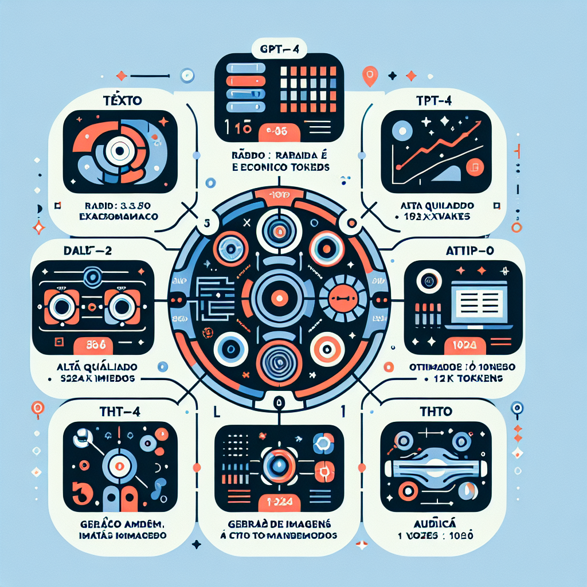

# Introducao a OpenAI

**Referencia:** Secao 00 - Fundamentos

---

## O que e OpenAI?

A OpenAI e uma organizacao de pesquisa em inteligencia artificial estabelecida em 2015 com o proposito de desenvolver IA de forma segura e acessivel. Iniciada como uma entidade sem fins lucrativos, a empresa evoluiu para um modelo de lucro limitado em 2019 para viabilizar o financiamento de pesquisas em larga escala e o desenvolvimento de infraestrutura para modelos massivos.

## Historia e Evolucao

### Fundacao (Dezembro de 2015)
- Fundadores: Elon Musk, Sam Altman, Greg Brockman, Ilya Sutskever, Wojciech Zaremba e John Schulman.
- Proposito: Pesquisa aberta em IA para contrapor o desenvolvimento fechado em grandes corporacoes.

### Cronologia de Modelos

**Fevereiro de 2019 - GPT-2:**
- Modelo Generative Pre-trained Transformer com 1.5 bilhoes de parametros.
- Demonstrou capacidades ineditas de geracao de texto coerente.

**Maio de 2020 - GPT-3:**
- Salto para 175 bilhoes de parametros.
- Introducao do conceito de few-shot learning (aprendizado com poucos exemplos no prompt).
- Lancamento da API comercial em junho de 2020.

**Janeiro de 2021 - DALL-E:**
- Primeiro modelo de difusao para geracao de imagens a partir de descricoes textuais.

**Abril de 2022 - DALL-E 2:**
- Evolucao com maior resolucao e precisao na compreensao de atributos visuais.

**Novembro de 2022 - ChatGPT:**
- Interface de chat otimizada via Fine-tuning e RLHF (Reinforcement Learning from Human Feedback).
- Transformou a interacao com LLMs em uma ferramenta de produtividade em massa.

**Marco de 2023 - GPT-4:**
- Modelo multimodal capaz de processar texto e imagem.
- Melhoria significativa em raciocinio logico e seguranca.

**Setembro de 2023 - DALL-E 3:**
- Integracao nativa com ChatGPT para refinamento de prompts.

**Novembro de 2023 - GPT-4 Turbo:**
- Janela de contexto expandida para 128k tokens e base de dados atualizada ate abril de 2023.

## Modelos Disponiveis

### Chat Completions
- **gpt-3.5-turbo**: Otimizado para custo e velocidade.
- **gpt-4**: Referencia em qualidade e raciocinio complexo.
- **gpt-4-turbo**: Versao avancada com maior contexto e menor latencia.

### Image Generation
- **dall-e-3**: Alta fidelidade e interpretacao de detalhes.
- **dall-e-2**: Versao anterior para geracao rapida e economica.

### Audio e Transcricao
- **whisper-1**: Sistema de reconhecimento de fala robusto para transcricao e traducao.
- **tts-1 / tts-1-hd**: Conversao de texto em fala com vozes naturais.

### Vetorizacao (Embeddings)
- **text-embedding-3-small**: Balanceamento entre performance e economia.
- **text-embedding-3-large**: Alta densidade vetorial para buscas semanticas precisas.

## Aplicacoes e Casos de Uso

- **Processamento de Linguagem Natural**: Sumarizacao, classificacao, traducao e escrita criativa.
- **Desenvolvimento de Software**: Geracao de codigo, refatoracao e documentacao automatica.
- **Analise de Dados**: Extracao de entidades e estruturacao de dados nao estruturados.
- **Multimodalidade**: Analise visual de documentos e acessibilidade via audio.

## Criterios para Utilizacao da API

### Vantagens
- Dispensa treinamento de modelos proprios do zero.
- Infraestrutura escalavel gerenciada por terceiros.
- Acesso imediato ao estado da arte em IA generativa.

### Limitacoes e Cuidados
- **Privacidade**: Dados enviados sao processados em servidores externos (requer analise de conformidade).
- **Custo**: Tarifacao por volume de uso (tokens).
- **Dependencia**: Vinculo com a disponibilidade e politicas da plataforma OpenAI.

## Proximos Passos

O entendimento da arquitetura tecnica e o proximo requisito:
1. Arquitetura da API: Funcionamento interno e protocolos.
2. Autenticacao e Seguranca: Configuracao do ambiente de trabalho.

---

## Fontes de Consulta

- OpenAI Platform (platform.openai.com)
- Documentacao Tecnica Oficial
- Publicacoes de Pesquisa da OpenAI
