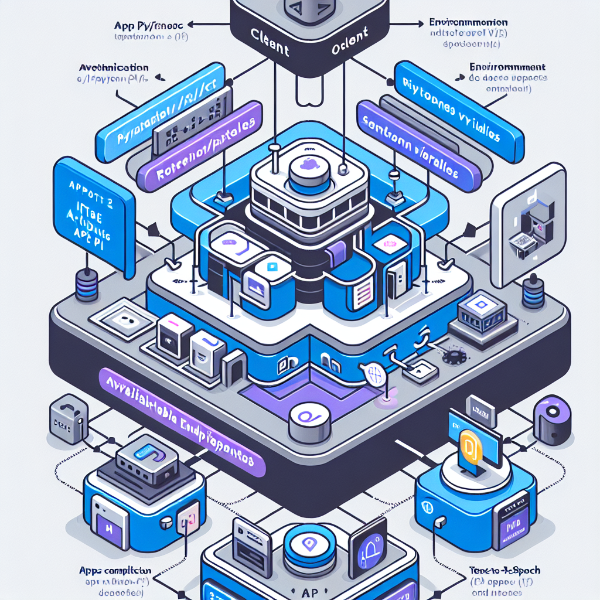

# Arquitetura da API OpenAI

**Referencia:** Secao 00 - Fundamentos

---

## Visao Geral



A OpenAI disponibiliza seus modelos atraves de uma arquitetura RESTful. Isso permite que qualquer aplicacao capaz de realizar requisicoes HTTP possa integrar funcionalidades de IA generativa de forma programatica.

## Protocolo de Requisicao

### Base URL
```
https://api.openai.com/v1/
```

### Cabecalhos (Headers)
- `Authorization: Bearer {API_KEY}`: Obrigatorio para autenticacao.
- `Content-Type: application/json`: Padrao para o corpo da mensagem.

### Estrutura do JSON
O corpo da requisicao varia conforme o endpoint, mas geralmente segue o esquema:
```json
{
  "model": "nome-do-modelo",
  "parametro_1": "valor",
  "parametro_n": "valor"
}
```

## Endpoints e Servicos

### 1. Chat Completions (`/v1/chat/completions`)
Principal servico para interacao textual. Introduz o conceito de roles (papeis):
- **system**: Define o comportamento base.
- **user**: Entrada do usuario.
- **assistant**: Resposta anterior do modelo.

### 2. Image Generation (`/v1/images/generations`)
Interface para o DALL-E. 
- DALL-E 3: Focado em alta qualidade, gera uma imagem por vez.
- DALL-E 2: Permite geracao em lote (parametro `n`).

### 3. Audio Services
- **Speech (`/v1/audio/speech`)**: Texto para audio (TTS). Retorna binario.
- **Transcriptions (`/v1/audio/transcriptions`)**: Audio para texto (STT). Requer `multipart/form-data`.

### 4. Embeddings (`/v1/embeddings`)
Gera representacoes numericas (vetores) de texto. Essencial para buscas semanticas e RAG (Retrieval-Augmented Generation).

## Gestao de Recursos e Limites

### Tokens
- Unidade fundamental de processamento.
- Regra pratica: 1000 tokens equivalem a aproximadamente 750 palavras.
- A tarifacao e baseada na soma de tokens de entrada (prompt) e tokens de saida (completion).

### Context Window (Janela de Contexto)
Limite maximo de tokens que o modelo consegue "enxergar" simultaneamente:
- **gpt-3.5-turbo**: 16,385 tokens.
- **gpt-4-turbo**: 128,000 tokens.
- **gpt-4**: 8,192 tokens.

### Rate Limits
Controlados por nivel de conta (Tiers):
- **RPM** (Requests Per Minute).
- **TPM** (Tokens Per Minute).
- **RPD** (Requests Per Day).

## Codigos de Retorno e Erros

- **200 OK**: Sucesso.
- **401 Unauthorized**: Chave invalida.
- **429 Too Many Requests**: Limite de requisicoes atingido.
- **500 Internal Server Error**: Falha no servidor da OpenAI.

## Melhores Praticas

1. **Tratamento de Erros**: Implementar logs detalhados e mecanismos de retry com backoff exponencial.
2. **Seguranca**: Jamais incluir chaves de API no frontend ou repositorios publicos.
3. **Eficiencia**: Utilizar `max_tokens` para prevenir respostas excessivamente longas e custos desnecessarios.

---

## Referencias Tecnicas

- API Reference (platform.openai.com/docs/api-reference)
- Guias de Otimizacao de Rate Limits
- Documentacao de Modelos e Endpoints
