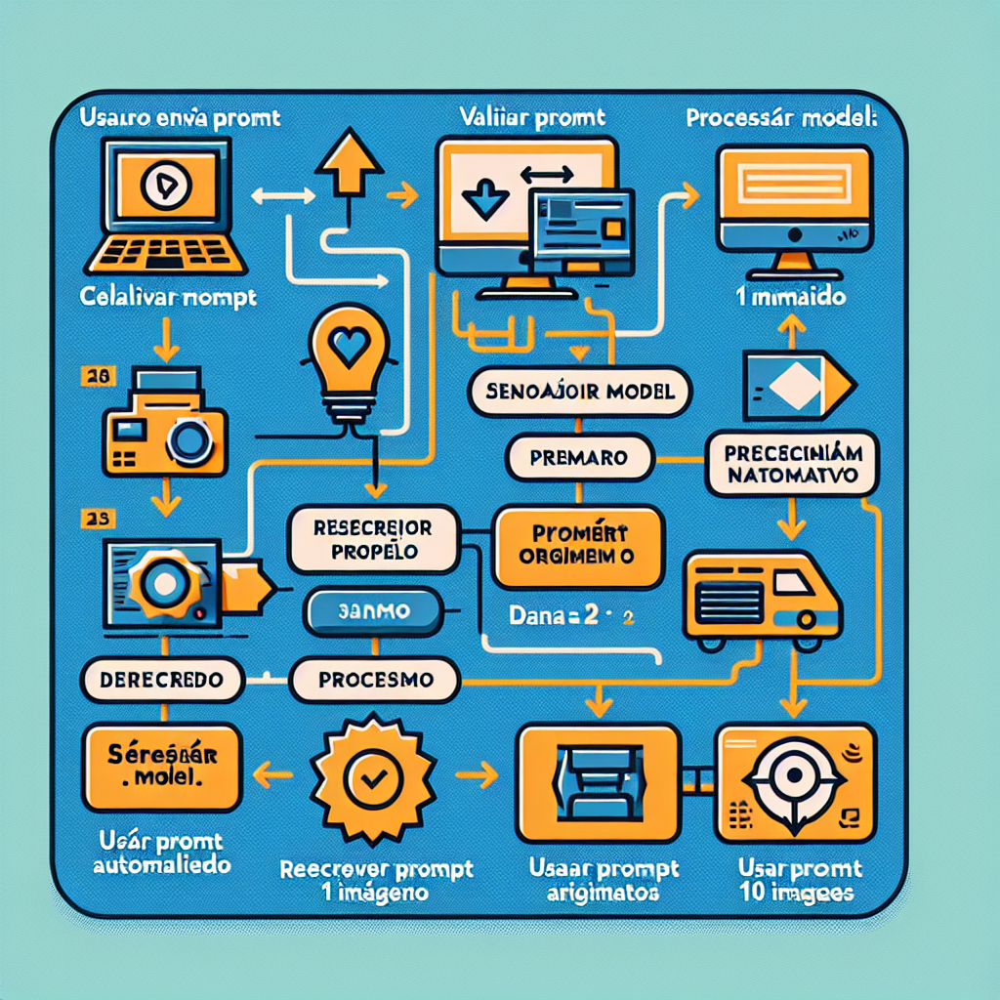

# Image Generation - DALL-E

Esta seção contém tutoriais sobre geração de imagens usando a API DALL-E da OpenAI.

## Tutoriais Disponíveis

### 01 - DALL-E Básico
**Arquivo:** `notebooks/01-dalle-basico.ipynb`

Aprenda os fundamentos da geração de imagens:
- Como gerar imagens com DALL-E 3
- Parâmetros principais (model, prompt, size, quality)
- Salvar imagens localmente

**Pré-requisitos:** Nenhum

---

### 02 - Variações de Imagem
**Arquivo:** `notebooks/02-dalle-variacoes.ipynb`

Explore variações de imagens:
- Gerar múltiplas imagens com DALL-E 2
- Criar variações de uma imagem existente
- Comparar DALL-E 2 vs DALL-E 3

**Pré-requisitos:** Tutorial 01

---

### 03 - Edição de Imagens
**Arquivo:** `notebooks/03-dalle-edicao.ipynb` (Em breve)

Aprenda a editar imagens existentes:
- Editar partes específicas de imagens
- Adicionar elementos a imagens
- Casos de uso práticos

**Pré-requisitos:** Tutorial 01

---

## Modelos Disponíveis

### DALL-E 3
- Modelo mais recente e avançado
- Sempre gera 1 imagem por requisição
- Melhor compreensão de prompts complexos
- Tamanhos: `1024x1024`, `1792x1024`, `1024x1792`
- Qualidade: `standard` ou `hd`

### DALL-E 2
- Modelo anterior, ainda disponível
- Pode gerar até 10 imagens por requisição
- Tamanhos: `256x256`, `512x512`, `1024x1024`
- Mais econômico, mas menos detalhado

---

## Dicas para Prompts Efetivos

1. **Seja específico e descritivo**
   - Mencione estilo artístico se desejar
   - Inclua detalhes sobre cores, iluminação, composição

2. **Evite prompts muito longos**
   - DALL-E 3 reescreve automaticamente prompts longos
   - Seja conciso mas detalhado

3. **Mencione qualidade desejada**
   - "fotografia profissional"
   - "ilustração digital"
   - "pintura a óleo"

---

## Custos

- **DALL-E 3 Standard (1024x1024)**: $0.04 por imagem
- **DALL-E 3 HD (1024x1024)**: $0.08 por imagem
- **DALL-E 2 (1024x1024)**: $0.02 por imagem

---

## Referências

- [Documentação - DALL-E](https://platform.openai.com/docs/guides/images)
- [API Reference - Images](https://platform.openai.com/docs/api-reference/images)

