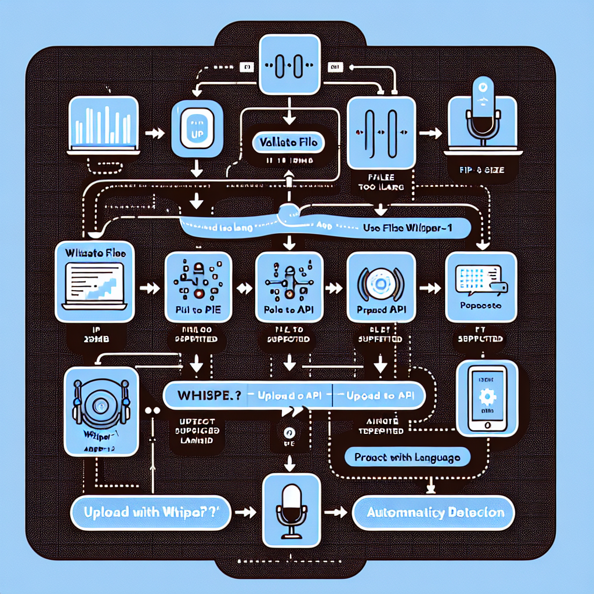

# Audio - Text-to-Speech e Speech-to-Text

Esta seção contém tutoriais sobre processamento de áudio usando as APIs da OpenAI.

## Tutoriais Disponíveis

### 01 - Text-to-Speech (TTS)
**Arquivo:** `notebooks/01-text-to-speech.ipynb`

Aprenda a converter texto em áudio:
- Modelos disponíveis (tts-1, tts-1-hd)
- Vozes disponíveis (alloy, echo, fable, onyx, nova, shimmer)
- Controlar velocidade e qualidade
- Formatos de áudio suportados

**Pré-requisitos:** Nenhum

---

### 02 - Speech-to-Text (Whisper)
**Arquivo:** `notebooks/02-speech-to-text.ipynb`

Aprenda a transcrever áudio em texto:
- Modelo Whisper-1
- Formatos de áudio suportados
- Formatos de resposta (json, text, srt, vtt)
- Melhorar precisão com prompts

**Pré-requisitos:** Nenhum

---

### 03 - Tradução de Áudio
**Arquivo:** `notebooks/03-traducao-audio.ipynb`

Aprenda a transcrever e traduzir áudio:
- Transcrição em idioma original
- Tradução automática
- Casos de uso práticos

**Pré-requisitos:** Tutorial 02

---

## Modelos Disponíveis

### Text-to-Speech
- **tts-1**: Padrão, rápido ($15/milhão de caracteres)
- **tts-1-hd**: Alta qualidade ($30/milhão de caracteres)

### Speech-to-Text
- **whisper-1**: Modelo único, alta precisão ($0.006 por minuto)

---

## Formatos Suportados

### Text-to-Speech
- `mp3`, `opus`, `aac`, `flac`

### Speech-to-Text (Whisper)
- `mp3`, `mp4`, `mpeg`, `mpga`, `m4a`, `wav`, `webm`
- Tamanho máximo: 25 MB por arquivo

---

## Casos de Uso

- **Narração de conteúdo**: Artigos, posts, documentação
- **Assistente de voz**: Chatbots com voz
- **Acessibilidade**: Texto para fala e vice-versa
- **Transcrição de reuniões**: Converter áudio em texto
- **Legendagem automática**: Gerar legendas para vídeos
- **E-learning**: Narração de cursos

---

## Referências

- [Documentação - Text-to-Speech](https://platform.openai.com/docs/guides/text-to-speech)
- [Documentação - Speech-to-Text](https://platform.openai.com/docs/guides/speech-to-text)
- [API Reference - Audio](https://platform.openai.com/docs/api-reference/audio)

