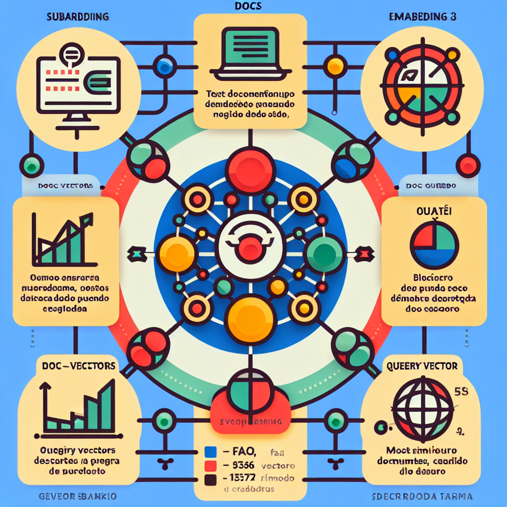

# Embeddings - Vetorização de Texto

Esta seção contém tutoriais sobre embeddings e busca semântica usando a API da OpenAI.

## Tutoriais Disponíveis

### 01 - Vetorização de Texto
**Arquivo:** `notebooks/01-vetorizacao-texto.ipynb`

Aprenda a criar embeddings de texto:
- Modelos disponíveis (text-embedding-3-small, text-embedding-3-large)
- Dimensões dos vetores
- Casos de uso práticos (FAQ inteligente, busca semântica)

**Pré-requisitos:** Nenhum

---

### 02 - Busca Semântica
**Arquivo:** `notebooks/02-busca-semantica.ipynb` (Em breve)

Aprenda a implementar busca semântica:
- Calcular similaridade coseno
- Buscar documentos similares
- Integrar com bancos vetoriais (FAISS, Pinecone)

**Pré-requisitos:** Tutorial 01

---

## Modelos Disponíveis

- **text-embedding-3-small**: 1536 dimensões, mais rápido
- **text-embedding-3-large**: 3072 dimensões, melhor qualidade

---

## Casos de Uso

- **Busca semântica**: Encontrar documentos similares
- **FAQ inteligente**: Responder perguntas baseado em similaridade
- **Recomendação de conteúdo**: Sugerir conteúdo relacionado
- **Clustering de texto**: Agrupar textos similares
- **Análise de sentimento**: Classificar textos

---

## Referências

- [Documentação - Embeddings](https://platform.openai.com/docs/guides/embeddings)
- [API Reference - Embeddings](https://platform.openai.com/docs/api-reference/embeddings)

