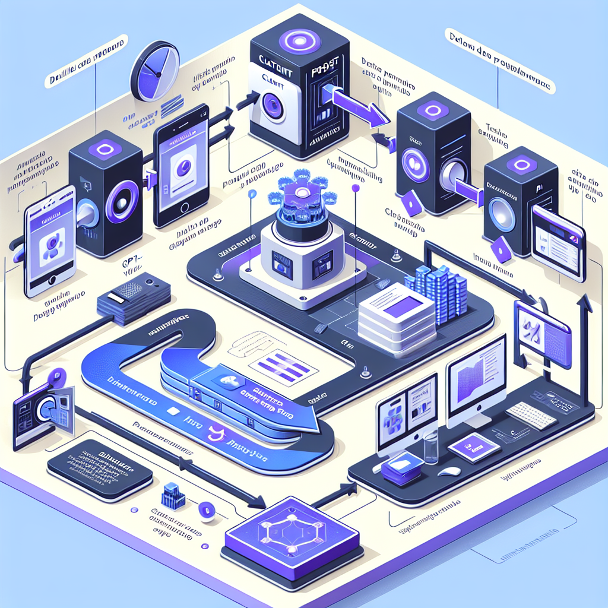

# Vision - Análise Visual e OCR

**Referência:** Seção 05 - Vision

---

## Visão Geral

A API de Visão da OpenAI permite que os modelos GPT-4 compreendam e analisem conteúdos visuais, como imagens, gráficos e documentos digitalizados.

## Capacidades Principais

- **Descrição de Imagens**: Gerar descrições detalhadas do que está acontecendo em uma imagem.
- **OCR Avançado**: Extrair texto de documentos, placas, capturas de tela, etc.
- **Análise de Gráficos**: Interpretar dados visuais em gráficos e tabelas.
- **Detecção de Objetos**: Identificar elementos específicos dentro de uma cena.

## Modelos Suportados

- **gpt-4o**: O modelo mais recente e capaz para visão.
- **gpt-4-turbo**: Suporta análise de imagem via Chat Completions.

---

## Referências

- [Documentação Oficial - Vision](https://platform.openai.com/docs/guides/vision)
- [API Reference - Vision](https://platform.openai.com/docs/api-reference/chat/create#chat-create-messages)

