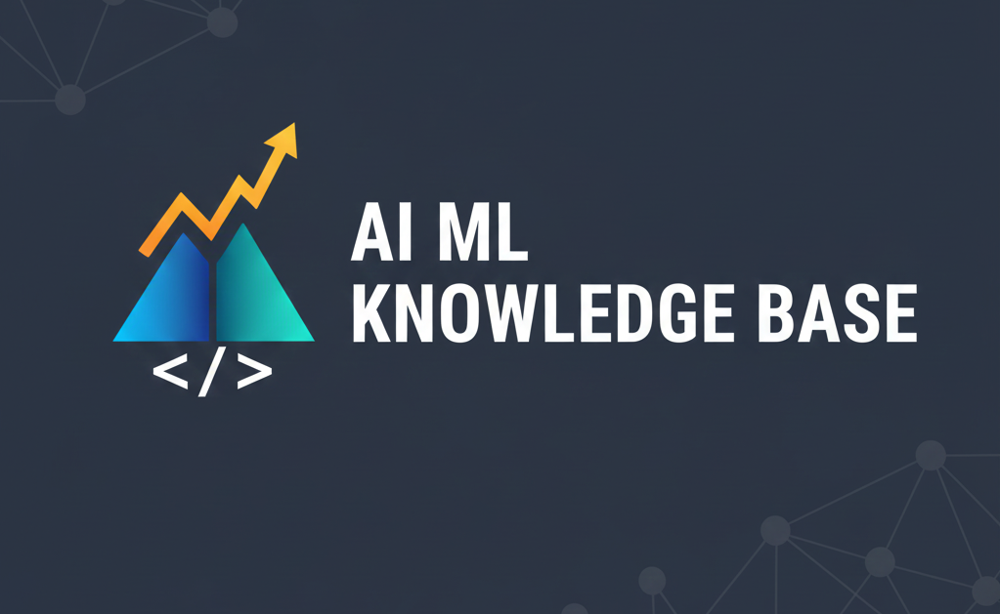

<div align="center">
  
</div>

# 🧠 IA-ML-KNOWLEDGE-BASE

[](https://www.python.org/downloads/)
[](https://fastapi.tiangolo.com/)
[](LICENSE)
[](https://github.com/LucasBiason/ia-ml-knowledge-base)
[](https://github.com/LucasBiason/ia-ml-knowledge-base/actions)

> **Base de Conhecimento Completa em Inteligência Artificial e Machine Learning**  
> Um banco consolidando estudos, projetos práticos e documentação técnica avançada.

---

## 🎯 **OBJETIVO DO PROJETO**

Este repositório representa um **mega banco de conhecimento** sobre Inteligência Artificial e Machine Learning, consolidando:

- 📚 **Conhecimentos técnicos** de múltiplas fontes (cursos, apostilas)
- 🛠️ **Projetos práticos** desenvolvidos com padrões profissionais
- 📖 **200+ páginas** de documentação técnica especializada
- 💬 **100+ prompts** catalogados e testados

### **🎯 Metas Específicas**
- 🛠️ Desenvolver APIs profissionais
- 📚 Criar documentação técnica de referência
- 💼 Construir banco de conhecimento
- 📝 Publicar artigos técnicos (Hashnode, Dev.to)

---

## 📁 **ESTRUTURA DO PROJETO**

O projeto está organizado **por temas dentro de Inteligência Artificial**:

```
ia-ml-knowledge-base/
├── Machine Learning/          # ML tradicional, scikit-learn
├── Deep Learning/             # Redes neurais profundas
├── LLMs/                     # Large Language Models
├── LangChain/                # Framework para LLMs
├── Computer Vision/          # Visão computacional
├── NLP/                      # Processamento de linguagem natural
├── OpenAI API/                # Integrações OpenAI
├── AWS ML Services/          # Serviços AWS para ML
├── MLOps/                    # Deploy e monitoramento
└── articles/                 # Artigos formatados para publicação
```

Cada tema contém:
- `notebooks/` - Notebooks Jupyter práticos
- `tutorials/` - Tutoriais passo a passo
- `projects/` - Projetos completos
- `snippets/` - Códigos reutilizáveis

---

## 🛠️ **STACK UTILIZADA**

### **🔧 Tecnologias Principais**
- **Python 3.9+** - Linguagem principal
- **FastAPI** - Framework web para APIs
- **Docker & Docker Compose** - Containerização
- **PostgreSQL** - Banco de dados principal
- **Redis** - Cache e filas

### **🤖 Machine Learning & IA**
- **scikit-learn** - Algoritmos de ML
- **TensorFlow/PyTorch** - Deep Learning
- **LangChain** - Framework para LLMs
- **OpenAI API** - Integração com GPT
- **Gemini API** - Integração com Gemini

### **🔍 Qualidade & Testes**
- **pytest** - Framework de testes
- **Black** - Formatação de código
- **isort** - Organização de imports
- **flake8** - Linting

---

## 📚 **NAVEGAÇÃO RÁPIDA**

### **Por Tema:**
- [Machine Learning](./Machine%20Learning/) - Algoritmos clássicos de ML
- [Deep Learning](./Deep%20Learning/) - Redes neurais profundas
- [LLMs](./LLMs/) - Large Language Models
- [LangChain](./LangChain/) - Framework para LLMs
- [Computer Vision](./Computer%20Vision/) - Visão computacional
- [NLP](./NLP/) - Processamento de linguagem natural
- [OpenAI API](./OpenAI%20API/) - Integrações OpenAI
- [AWS ML Services](./AWS%20ML%20Services/) - Serviços AWS
- [MLOps](./MLOps/) - Deploy e monitoramento

### **Documentação:**
- [CONTRIBUTING.md](./CONTRIBUTING.md) - Guia de contribuição
- [docs-private/](./docs-private/) - Documentação privada (não versionada)

---

## 🚀 **COMO USAR**

### **Instalação:**
```bash
# Clone o repositório
git clone https://github.com/LucasBiason/ia-ml-knowledge-base.git
cd ia-ml-knowledge-base

# Crie um ambiente virtual
python -m venv .venv
source .venv/bin/activate  # Linux/Mac
# ou
.venv\Scripts\activate  # Windows

# Instale as dependências
pip install -r requirements.txt
```

### **Executar Notebooks:**
```bash
# Inicie o Jupyter
jupyter notebook

# Ou use JupyterLab
jupyter lab
```

---

## 📝 **LICENÇA**

Este projeto está licenciado sob a Licença MIT - veja o arquivo [LICENSE](LICENSE) para detalhes.

---

*Desenvolvido com ❤️ por Lucas Biason para consolidar conhecimentos em IA/ML e criar um banco de conhecimento completo.*
